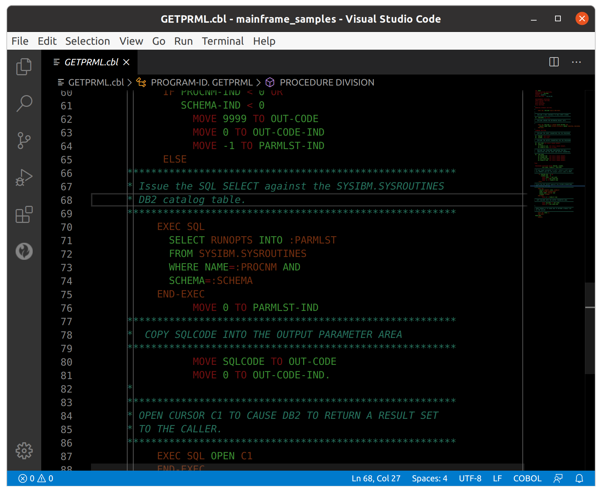
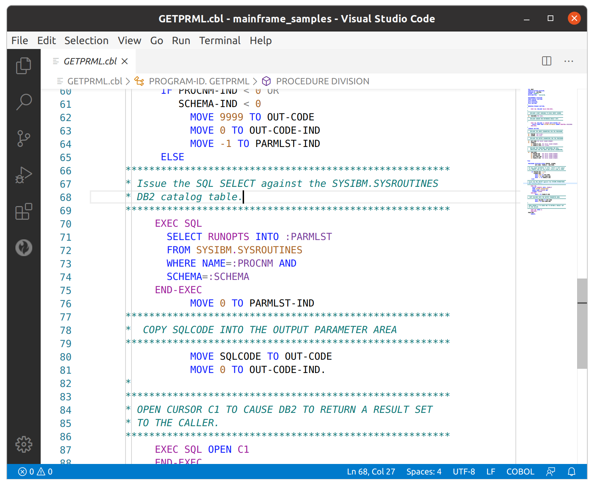
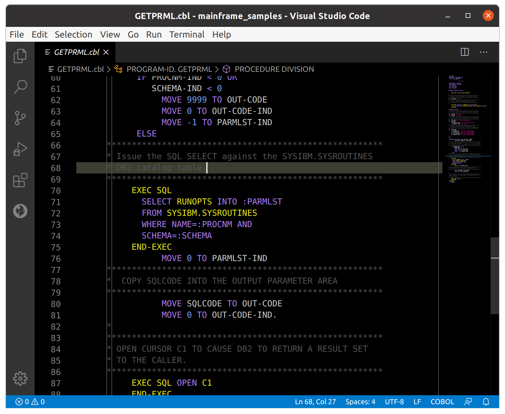

# README

## Themes included

| Theme title                             | Description                                               | Sample |
|-----------------------------------------|-----------------------------------------------------------|--|
| Throwback (ISPF Inspired)               | Dark Mainframe green screen inspired by ISPF              |  |
| Throwback (Eclipse Inspired)            | Light theme simular to one used in Eclipse                |  |
| Throwback (NX Inspired)                 | Dark theme simular to one used in Net Express             |  |
| Enterprise COBOL (for entcobol dialect) | Dark theme designed for use with Enterprise COBOL dialect |   |
